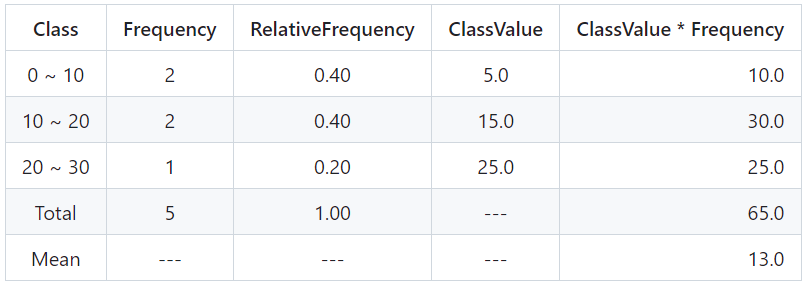
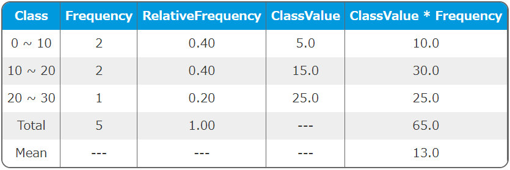

# PHP-FrequencyTable

## 1. Features

`PHP-FrequencyTable` is a library to operate Frequency Tables easily.

You can create Frequency Tables easily just by setting data in array and Class Range.

You can get or save them in some formats, Markdown Table, CSV, TSV and HTML.

English(default) and Japanese are supported.

You can also get parsed data as hash array of PHP.

<a href="#the-most-simple-usage"></a>

## 2. Contents
- [1. Features](#1-features)
- 2\. Contents
- [3. Requirements](#3-requirements)
- [4. Installation](#4-installation)
- [5. Usage](#5-usage)
    - [5.1. Basic Usage](#51-basic-usage)
    - [5.2. Changing Data and Class Range](#52-changing-data-and-class-range)
    - [5.3. Changing Columns for Output](#53-changing-columns-for-output)
    - [5.4. Changing Language](#54-changing-language)
    - [5.5. Saving data into CSV](#55-saving-data-into-csv)
    - [5.6. Saving data into TSV](#56-saving-data-into-tsv)
    - [5.7. Saving data into HTML](#57-saving-data-into-html)
    - [5.8. Saving data into Markdown](#58-saving-data-into-markdown)
    - [5.9. Retrieving Parsed Data](#59-retrieving-parsed-data)
    - [5.10. Reverse Classes](#510-reverse-classes)
- [6. Examples](#6-examples)
- [7. LICENSE](#7-license)

## 3. Requirements

- PHP 8.1 or later
- Composer

## 4. Installation

```bash
composer require macocci7/php-frequency-table
```

## 5. Usage

- [5.1. Basic Usage](#51-basic-usage)
- [5.2. Changing Data and Class Range](#52-changing-data-and-class-range)
- [5.3. Changing Columns for Output](#53-changing-columns-for-output)
- [5.4. Changing Language](#54-changing-language)
- [5.5. Saving data into CSV](#55-saving-data-into-csv)
- [5.6. Saving data into TSV](#56-saving-data-into-tsv)
- [5.7. Saving data into HTML](#57-saving-data-into-html)
- [5.8. Saving data into Markdown](#58-saving-data-into-markdown)
- [5.9. Retrieving Parsed Data](#59-retrieving-parsed-data)

### 5.1. Basic Usage

You can use FrequencyTable class as follows.

- PHP: [examples/BasicUsage.php](examples/BasicUsage.php)

    ```php
    <?php

    require_once __DIR__ . '/../vendor/autoload.php';

    use Macocci7\PhpFrequencyTable\FrequencyTable;

    $ft = new FrequencyTable([
        'data' => [ 0, 5, 10, 15, 20, ],
        'classRange' => 10,
    ]);
    echo $ft->meanOn()->markdown();
   ```

- Output: [examples/BasicUsage.md](examples/BasicUsage.md)

    ```bash
    |Class|Frequency|RelativeFrequency|ClassValue|ClassValue * Frequency|
    |:---:|:---:|:---:|:---:|---:|
    |0 ~ 10|2|0.40|5.0|10.0|
    |10 ~ 20|2|0.40|15.0|30.0|
    |20 ~ 30|1|0.20|25.0|25.0|
    |Total|5|1.00|---|65.0|
    |Mean|---|---|---|13.0|
    ```

- View: [examples/BasicUsage.md](examples/BasicUsage.md)

    |Class|Frequency|RelativeFrequency|ClassValue|ClassValue * Frequency|
    |:---:|:---:|:---:|:---:|---:|
    |0 ~ 10|2|0.40|5.0|10.0|
    |10 ~ 20|2|0.40|15.0|30.0|
    |20 ~ 30|1|0.20|25.0|25.0|
    |Total|5|1.00|---|65.0|
    |Mean|---|---|---|13.0|

- Details:

    - Import autoloader: `require_once __DIR__ . '/../vendor/autoload.php';`
    - Declare: `use Macocci7\PhpFrequencyTable\FrequencyTable;`
    - Instantiate: `new FrequencyTable()`
        - Option Params: `data`, `classRange`, `columns2Show`
            - `data`: array
            - `classRange`: int
            - `columns2Show`: array, acceptable values are as follows
                - 'Class'
                - 'Frequency'
                - 'CumulativeFrequency'
                - 'RelativeFrequency'
                - 'CumulativeRelativeFrequency'
                - 'ClassValue'
                - 'ClassValue * Frequency'
                - 'Subtotal'
                - 'RelativeSubtotal'
                - 'CumulativeRelativeSubtotal'
    - Mean Row: `meanOff()` as default, add by `meanOn()`.
    - Get Frequency Table: by `markdown()` in markdown format.

### 5.2. Changing Data and Class Range

You can change data and class range after instantiation.

- PHP: [examples/ChangeDataClassRange.php](examples/ChangeDataClassRange.php)

    ```php
    <?php

    require_once __DIR__ . '/../vendor/autoload.php';

    use Macocci7\PhpFrequencyTable\FrequencyTable;

    $ft = new FrequencyTable();

    $dataset = [
        'Group A' => [
            'data' => [ 90, 20, 80, 30, 70, 40, 60, ],
            'classRange' => 20,
        ],
        'Group B' => [
            'data' => [ 100, 10, 65, 40, 55, 90, 72, 84, ],
            'classRange' => 25,
        ],
    ];

    echo "# Frequency Tables\n\n";
    foreach ($dataset as $key => $data) {
        $ft->setClassRange($data['classRange']);
        $ft->setData($data['data']);
        echo "## " . $key . "\n\n";
        echo $ft->meanOn()->markdown() . "\n\n";
    }
    ```

- Output: [examples/ChangeDataClassRange.md](examples/ChangeDataClassRange.md)

    ```bash
    # Frequency Tables

    ## Group A

    |Class|Frequency|RelativeFrequency|ClassValue|ClassValue * Frequency|
    |:---:|:---:|:---:|:---:|---:|
    |20 ~ 40|2|0.29|30.0|60.0|
    |40 ~ 60|1|0.14|50.0|50.0|
    |60 ~ 80|2|0.29|70.0|140.0|
    |80 ~ 100|2|0.29|90.0|180.0|
    |Total|7|1.00|---|430.0|
    |Mean|---|---|---|61.4|


    ## Group B

    |Class|Frequency|RelativeFrequency|ClassValue|ClassValue * Frequency|
    |:---:|:---:|:---:|:---:|---:|
    |0 ~ 25|1|0.13|12.5|12.5|
    |25 ~ 50|1|0.13|37.5|37.5|
    |50 ~ 75|3|0.38|62.5|187.5|
    |75 ~ 100|2|0.25|87.5|175.0|
    |100 ~ 125|1|0.13|112.5|112.5|
    |Total|8|1.00|---|525.0|
    |Mean|---|---|---|65.6|
    ```

- View: [examples/ChangeDataClassRange.md](examples/ChangeDataClassRange.md)

    # Frequency Tables

    ## Group A

    |Class|Frequency|RelativeFrequency|ClassValue|ClassValue * Frequency|
    |:---:|:---:|:---:|:---:|---:|
    |20 ~ 40|2|0.29|30.0|60.0|
    |40 ~ 60|1|0.14|50.0|50.0|
    |60 ~ 80|2|0.29|70.0|140.0|
    |80 ~ 100|2|0.29|90.0|180.0|
    |Total|7|1.00|---|430.0|
    |Mean|---|---|---|61.4|


    ## Group B

    |Class|Frequency|RelativeFrequency|ClassValue|ClassValue * Frequency|
    |:---:|:---:|:---:|:---:|---:|
    |0 ~ 25|1|0.13|12.5|12.5|
    |25 ~ 50|1|0.13|37.5|37.5|
    |50 ~ 75|3|0.38|62.5|187.5|
    |75 ~ 100|2|0.25|87.5|175.0|
    |100 ~ 125|1|0.13|112.5|112.5|
    |Total|8|1.00|---|525.0|
    |Mean|---|---|---|65.6|

- Details:
    - Set Class Range: `setClassRange()`
    - Set Data: `setData()`

### 5.3. Changing Columns for Output

- PHP: [examples/ChangeColumns.php](examples/ChangeColumns.php)

    ```php
    <?php

    require_once __DIR__ . '/../vendor/autoload.php';

    use Macocci7\PhpFrequencyTable\FrequencyTable;

    $columns = [ 'Class', 'Frequency', ];
    $ft = new FrequencyTable([
        'data' => [ 5, 10, 15, 20, 24, 27, 29, 30, 35, 40, ],
        'classRange' => 10,
        'columns2Show' => $columns,
    ]);

    echo "# Changing Columns\n\n";

    echo "## Case1:\n\n";
    echo $ft->markdown() . "\n\n";

    $columns = [ 'Class', 'Frequency', 'RelativeFrequency', ];
    echo "## Case2:\n\n";
    echo $ft->setColumns2Show($columns)->markdown() . "\n\n";

    $columns = $ft->getValidColumns2Show();
    echo "## Case3:\n\n";
    echo $ft->setColumns2Show($columns)->meanOn()->markdown() . "\n\n";
    ```

- Output: [examples/ChangeColumns.md](examples/ChangeColumns.md)

    ```bash
    # Changing Columns

    ## Case1:

    |Class|Frequency|
    |:---:|:---:|
    |0 ~ 10|1|
    |10 ~ 20|2|
    |20 ~ 30|4|
    |30 ~ 40|2|
    |40 ~ 50|1|
    |Total|10|


    ## Case2:

    |Class|Frequency|RelativeFrequency|
    |:---:|:---:|:---:|
    |0 ~ 10|1|0.10|
    |10 ~ 20|2|0.20|
    |20 ~ 30|4|0.40|
    |30 ~ 40|2|0.20|
    |40 ~ 50|1|0.10|
    |Total|10|1.00|


    ## Case3:

    |Class|Frequency|CumulativeFrequency|RelativeFrequency|CumulativeRelativeFrequency|ClassValue|ClassValue * Frequency|Subtotal|RelativeSubtotal|CumulativeRelativeSubtotal|
    |:---:|:---:|:---:|:---:|:---:|:---:|---:|---:|---:|---:|
    |0 ~ 10|1|1|0.10|0.10|5.0|5.0|5.00|0.02|0.02|
    |10 ~ 20|2|3|0.20|0.30|15.0|30.0|25.00|0.11|0.13|
    |20 ~ 30|4|7|0.40|0.70|25.0|100.0|100.00|0.43|0.55|
    |30 ~ 40|2|9|0.20|0.90|35.0|70.0|65.00|0.28|0.83|
    |40 ~ 50|1|10|0.10|1.00|45.0|45.0|40.00|0.17|1.00|
    |Total|10|10|1.00|1.00|---|250.0|235.00|1.00|1.00|
    |Mean|---|---|---|---|---|25.0|23.50|---|---|
    ```

- View: [examples/ChangeColumns.md](examples/ChangeColumns.md)

    # Changing Columns

    ## Case1:

    |Class|Frequency|
    |:---:|:---:|
    |0 ~ 10|1|
    |10 ~ 20|2|
    |20 ~ 30|4|
    |30 ~ 40|2|
    |40 ~ 50|1|
    |Total|10|


    ## Case2:

    |Class|Frequency|RelativeFrequency|
    |:---:|:---:|:---:|
    |0 ~ 10|1|0.10|
    |10 ~ 20|2|0.20|
    |20 ~ 30|4|0.40|
    |30 ~ 40|2|0.20|
    |40 ~ 50|1|0.10|
    |Total|10|1.00|


    ## Case3:

    |Class|Frequency|CumulativeFrequency|RelativeFrequency|CumulativeRelativeFrequency|ClassValue|ClassValue * Frequency|Subtotal|RelativeSubtotal|CumulativeRelativeSubtotal|
    |:---:|:---:|:---:|:---:|:---:|:---:|---:|---:|---:|---:|
    |0 ~ 10|1|1|0.10|0.10|5.0|5.0|5.00|0.02|0.02|
    |10 ~ 20|2|3|0.20|0.30|15.0|30.0|25.00|0.11|0.13|
    |20 ~ 30|4|7|0.40|0.70|25.0|100.0|100.00|0.43|0.55|
    |30 ~ 40|2|9|0.20|0.90|35.0|70.0|65.00|0.28|0.83|
    |40 ~ 50|1|10|0.10|1.00|45.0|45.0|40.00|0.17|1.00|
    |Total|10|10|1.00|1.00|---|250.0|235.00|1.00|1.00|
    |Mean|---|---|---|---|---|25.0|23.50|---|---|

- Details:
    - Get Acceptable Columns: `getValidColumns2Show()`
    - Get Current Columns: `getColumns2Show()`
    - Set Columns: `setColumns2Show()`

### 5.4. Changing Language

English and Japanese are supported. (English as default)

- PHP: [examples/ChangeLang.php](examples/ChangeLang.php)

    ```php
    <?php

    require_once __DIR__ . '/../vendor/autoload.php';

    use Macocci7\PhpFrequencyTable\FrequencyTable;

    $ft = new FrequencyTable([
        'data' => [ 5, 10, 12, 15, 20, 25, 30, ],
        'classRange' => 10,
    ]);
    $ft->meanOn()->setColumns2Show($ft->getValidColumns2Show());

    echo "# Supported Languages\n\n";
    foreach ($ft->langs() as $index => $lang) {
        echo "## Language:[" . $lang . "]\n\n";
        echo $ft->lang($lang)->markdown() . "\n\n";
    }
    ```

- Output: [examples/ChangeLang.md](examples/ChangeLang.md)

    ```bash
    # Supported Languages

    ## Language:[eng]

    |Class|Frequency|CumulativeFrequency|RelativeFrequency|CumulativeRelativeFrequency|ClassValue|ClassValue * Frequency|Subtotal|RelativeSubtotal|CumulativeRelativeSubtotal|
    |:---:|:---:|:---:|:---:|:---:|:---:|---:|---:|---:|---:|
    |0 ~ 10|1|1|0.14|0.14|5.0|5.0|5.00|0.04|0.04|
    |10 ~ 20|3|4|0.43|0.57|15.0|45.0|37.00|0.32|0.36|
    |20 ~ 30|2|6|0.29|0.86|25.0|50.0|45.00|0.38|0.74|
    |30 ~ 40|1|7|0.14|1.00|35.0|35.0|30.00|0.26|1.00|
    |Total|7|7|1.00|1.00|---|135.0|117.00|1.00|1.00|
    |Mean|---|---|---|---|---|19.3|16.71|---|---|


    ## Language:[ja]

    |階級|度数|累積度数|相対度数|累積相対度数|階級値|階級値 × 度数|小計|相対小計|累積相対小計|
    |:---:|:---:|:---:|:---:|:---:|:---:|---:|---:|---:|---:|
    |0 ~ 10|1|1|0.14|0.14|5.0|5.0|5.00|0.04|0.04|
    |10 ~ 20|3|4|0.43|0.57|15.0|45.0|37.00|0.32|0.36|
    |20 ~ 30|2|6|0.29|0.86|25.0|50.0|45.00|0.38|0.74|
    |30 ~ 40|1|7|0.14|1.00|35.0|35.0|30.00|0.26|1.00|
    |合計|7|7|1.00|1.00|---|135.0|117.00|1.00|1.00|
    |平均|---|---|---|---|---|19.3|16.71|---|---|
    ```

- View: [examples/ChangeLang.md](examples/ChangeLang.md)

    # Supported Languages

    ## Language:[eng]

    |Class|Frequency|CumulativeFrequency|RelativeFrequency|CumulativeRelativeFrequency|ClassValue|ClassValue * Frequency|Subtotal|RelativeSubtotal|CumulativeRelativeSubtotal|
    |:---:|:---:|:---:|:---:|:---:|:---:|---:|---:|---:|---:|
    |0 ~ 10|1|1|0.14|0.14|5.0|5.0|5.00|0.04|0.04|
    |10 ~ 20|3|4|0.43|0.57|15.0|45.0|37.00|0.32|0.36|
    |20 ~ 30|2|6|0.29|0.86|25.0|50.0|45.00|0.38|0.74|
    |30 ~ 40|1|7|0.14|1.00|35.0|35.0|30.00|0.26|1.00|
    |Total|7|7|1.00|1.00|---|135.0|117.00|1.00|1.00|
    |Mean|---|---|---|---|---|19.3|16.71|---|---|


    ## Language:[ja]

    |階級|度数|累積度数|相対度数|累積相対度数|階級値|階級値 × 度数|小計|相対小計|累積相対小計|
    |:---:|:---:|:---:|:---:|:---:|:---:|---:|---:|---:|---:|
    |0 ~ 10|1|1|0.14|0.14|5.0|5.0|5.00|0.04|0.04|
    |10 ~ 20|3|4|0.43|0.57|15.0|45.0|37.00|0.32|0.36|
    |20 ~ 30|2|6|0.29|0.86|25.0|50.0|45.00|0.38|0.74|
    |30 ~ 40|1|7|0.14|1.00|35.0|35.0|30.00|0.26|1.00|
    |合計|7|7|1.00|1.00|---|135.0|117.00|1.00|1.00|
    |平均|---|---|---|---|---|19.3|16.71|---|---|

- Details:
    - Get Supported Langs: `langs()`
    - Get Current Lang: `lang()`
    - Set Lang:
        - English(default): `lang('eng')`
        - Japanese: `lang('ja')`

### 5.5. Saving data into CSV

- PHP

    ```php
    <?php

    require_once __DIR__ . '/../vendor/autoload.php';

    use Macocci7\PhpFrequencyTable\FrequencyTable;

    $ft = new FrequencyTable([
        'data' => [ 0, 5, 10, 15, 20, ],
        'classRange' => 10,
    ]);

    $ft->meanOn()->save('test.csv');
    ```

- Result: `test.csv`

    ```
    "Class","Frequency","RelativeFrequency","ClassValue","ClassValue * Frequency"
    "0 ~ 10","2","0.40","5.0","10.0"
    "10 ~ 20","2","0.40","15.0","30.0"
    "20 ~ 30","1","0.20","25.0","25.0"
    "Total","5","1.00","---","65.0"
    "Mean","---","---","---","13.0"
    ```

- Details:
    - There're 2 options for saving CSV.
        1. `save(PATH)`: `PATH` must have `.csv` extension.
        2. `csv()`:  params as follows
            ```php
            csv(
                string|null $path = null,
                string $quotation = '"',
                string $eol = "\n"
            )
            ```
            - `$path`: File Path.
                - Bytes of csv file will be returned as type of int.
                - `false` will be returned when saving fails.
                - When `null` is given, csv will be returned as type of string.
            - `$quotation`: each values will be quoted with `$quotation`. 
                - double quot(default): specify `'"'`
                - single quot: specify `"'"`
            - `$eol`: The end of each line will end with `$eol`.
                - `"\n"`: `LF` (Line Feed)
                - `"\r"`: `CR` (Carrige Return)
                - `"\r\n"`: `CRLF`(Carrige Return + Line Feed)

            For example:
            ```php
            echo $ft->csv(
                quotation: "'",
                eol: "\r\n",
            );
            ```
            results in
            ```bash
            'Class','Frequency','RelativeFrequency','ClassValue','ClassValue * Frequency'
            '0 ~ 10','2','0.40','5.0','10.0'
            '10 ~ 20','2','0.40','15.0','30.0'
            '20 ~ 30','1','0.20','25.0','25.0'
            'Total','5','1.00','---','65.0'
            ```

### 5.6. Saving data into TSV

- PHP
    ```php
    <?php

    require_once __DIR__ . '/../vendor/autoload.php';

    use Macocci7\PhpFrequencyTable\FrequencyTable;

    $ft = new FrequencyTable([
        'data' => [ 0, 5, 10, 15, 20, ],
        'classRange' => 10,
    ]);

    $ft->meanOn()->save('test.tsv');
    ```

- Result: `test.tsv`
    ```
    "Class"	"Frequency"	"RelativeFrequency"	"ClassValue"	"ClassValue * Frequency"
    "0 ~ 10"	"2"	"0.40"	"5.0"	"10.0"
    "10 ~ 20"	"2"	"0.40"	"15.0"	"30.0"
    "20 ~ 30"	"1"	"0.20"	"25.0"	"25.0"
    "Total"	"5"	"1.00"	"---"	"65.0"
    "Mean"	"---"	"---"	"---"	"13.0"
    ```

- Details:
    - There're 2 options for saving TSV
        1. `save(PATH)`: `PATH` must have `.tsv` extension.
        2. `tsv()`: params as follows
            ```php
            tsv(
                string|null $path = null,
                string $quotation = '"',
                string $eol = "\n"
            )
            ```
            - `$path`: File Path.
                - Bytes of tsv file will be returned as type of int.
                - `false` will be returned when saving fails.
                - When `null` is given, tsv will be returned as type of string.
            - `$quotation`: each values will be quoted with `$quotation`. 
                - double quot(default): specify `'"'`
                - single quot: specify `"'"`
            - `$eol`: The end of each line will end with `$eol`.
                - `"\n"`: `LF` (Line Feed)
                - `"\r"`: `CR` (Carrige Return)
                - `"\r\n"`: `CRLF`(Carrige Return + Line Feed)

            For example:
            ```php
            echo $ft->tsv(
                quotation: "'",
                eol: "\r\n",
            );
            ```
            results in
            ```bash
            'Class' 'Frequency'     'RelativeFrequency'     'ClassValue'    'ClassValue * Frequency'
            '0 ~ 10'        '2'     '0.40'  '5.0'   '10.0'
            '10 ~ 20'       '2'     '0.40'  '15.0'  '30.0'
            '20 ~ 30'       '1'     '0.20'  '25.0'  '25.0'
            'Total' '5'     '1.00'  '---'   '65.0'
            ```

### 5.7. Saving data into HTML

- PHP

    ```php
    <?php

    require_once __DIR__ . '/../vendor/autoload.php';

    use Macocci7\PhpFrequencyTable\FrequencyTable;

    $ft = new FrequencyTable([
        'data' => [ 0, 5, 10, 15, 20, ],
        'classRange' => 10,
    ]);

    $ft->meanOn()->save('test.html');
    ```

- Result: `test.html`

    ```html
    <table>
    <tr><td>Class</td><td>Frequency</td><td>RelativeFrequency</td><td>ClassValue</td><td>ClassValue * Frequency</td></tr>
    <tr><td>0 ~ 10</td><td>2</td><td>0.40</td><td>5.0</td><td>10.0</td></tr>
    <tr><td>10 ~ 20</td><td>2</td><td>0.40</td><td>15.0</td><td>30.0</td></tr>
    <tr><td>20 ~ 30</td><td>1</td><td>0.20</td><td>25.0</td><td>25.0</td></tr>
    <tr><td>Total</td><td>5</td><td>1.00</td><td>---</td><td>65.0</td></tr>
    <tr><td>Mean</td><td>---</td><td>---</td><td>---</td><td>13.0</td></tr>
    </table>
    ```

- View:
    - with css like this:
        ```css
        <style>
            table {
                border-collapse: separate;
                border-spacing: 0;
                border: 2px #666666 solid;
                border-radius: 12px;
                overflow: hidden;
            }
            table tr:nth-child(odd) td {
                background-color: #eeeeee;
            }
            table th {
                border-right: 1px #666666 solid;
                background-color: #0099dd;
                padding: 6px;
                white-space: nowrap;
                font-weight: bold;
                color: #ffffff;
            }
            table td {
                border-right: 1px #666666 solid;
                background-color: #ffffff;
                padding: 6px;
                white-space: nowrap;
                color: #333333;
                text-align: center;
            }
        </style>
        ```
    - html view:

        

- Details:
    - There're 2 options for saving html:
        1. `save(PATH)`: `PATH` must have `.html` extension.
        2. `html(PATH)`: param as follows
            ```php
            html(string|null $path = null)
            ```
            - `$path`: File Path.
                - Bytes of html file will be returned as type of int.
                - `false` will be returned when saving fails.
                - When `null` is given, html will be returned as type of string.

### 5.8. Saving data into Markdown

- PHP

    ```php
    <?php

    require_once __DIR__ . '/../vendor/autoload.php';

    use Macocci7\PhpFrequencyTable\FrequencyTable;

    $ft = new FrequencyTable([
        'data' => [ 0, 5, 10, 15, 20, ],
        'classRange' => 10,
    ]);

    $ft->meanOn()->save('test.md');
    ```

- Result: `test.md`

    ```html
    |Class|Frequency|RelativeFrequency|ClassValue|ClassValue * Frequency|
    |:---:|:---:|:---:|:---:|---:|
    |0 ~ 10|2|0.40|5.0|10.0|
    |10 ~ 20|2|0.40|15.0|30.0|
    |20 ~ 30|1|0.20|25.0|25.0|
    |Total|5|1.00|---|65.0|
    |Mean|---|---|---|13.0|
    ```

- View: `test.md`

    |Class|Frequency|RelativeFrequency|ClassValue|ClassValue * Frequency|
    |:---:|:---:|:---:|:---:|---:|
    |0 ~ 10|2|0.40|5.0|10.0|
    |10 ~ 20|2|0.40|15.0|30.0|
    |20 ~ 30|1|0.20|25.0|25.0|
    |Total|5|1.00|---|65.0|
    |Mean|---|---|---|13.0|

- Details:
    - There're 2 options for saving markdown
        1. `save(PATH)`: `PATH` must have `.md` extension.
        2. `markdown()`: param as follows.\
            ```php
            markdown(string|null $path = null)
            ```
            - `$path`: File Path.
                - Bytes of markdown file will be returned as type of int.
                - `false` will be returned when saving fails.
                - When `null` is given, markdown will be returned as type of string.

### 5.9. Retrieving Parsed Data

You can also retrieve parsed data without showing Frequency Table.

Use `parse()` method. `parse()` method returns Hash Array as follows.

- PHP

    ```php
    <?php

    require_once __DIR__ . '/../vendor/autoload.php';

    use Macocci7\PhpFrequencyTable\FrequencyTable;

    $ft = new FrequencyTable([
        'data' => [ 0, 5, 10, 15, 20, ],
        'classRange' => 10,
    ]);

    print_r($ft->parse());
    ```

- Result

    ```bash
    Array
    (
        [classRange] => 10
        [data] => Array
            (
                [0] => 0
                [1] => 5
                [2] => 10
                [3] => 15
                [4] => 20
            )

        [Max] => 20
        [Min] => 0
        [DataRange] => 20
        [Mode] => 5
        [Total] => 5
        [Mean] => 13
        [Median] => 10
        [MedianClass] => Array
            (
                [index] => 1
                [bottom] => 10
                [top] => 20
            )

        [FirstQuartile] => 2.5
        [ThirdQuartile] => 17.5
        [InterQuartileRange] => 15
        [QuartileDeviation] => 7.5
        [Classes] => Array
            (
                [0] => Array
                    (
                        [bottom] => 0
                        [top] => 10
                    )

                [1] => Array
                    (
                        [bottom] => 10
                        [top] => 20
                    )

                [2] => Array
                    (
                        [bottom] => 20
                        [top] => 30
                    )

            )

        [Frequencies] => Array
            (
                [0] => 2
                [1] => 2
                [2] => 1
            )

        [Subtotals] => Array
            (
                [0] => 5
                [1] => 25
                [2] => 20
            )

        [FrequencyTable] => Array
            (
                [tableHead] => Array
                    (
                        [0] => Class
                        [1] => Frequency
                        [2] => RelativeFrequency
                        [3] => ClassValue
                        [4] => ClassValue * Frequency
                    )

                [classData] => Array
                    (
                        [0] => Array
                            (
                                [Class] => 0 ~ 10
                                [Frequency] => 2
                                [RelativeFrequency] => 0.40
                                [ClassValue] => 5.0
                                [ClassValue * Frequency] => 10.0
                            )

                        [1] => Array
                            (
                                [Class] => 10 ~ 20
                                [Frequency] => 2
                                [RelativeFrequency] => 0.40
                                [ClassValue] => 15.0
                                [ClassValue * Frequency] => 30.0
                            )

                        [2] => Array
                            (
                                [Class] => 20 ~ 30
                                [Frequency] => 1
                                [RelativeFrequency] => 0.20
                                [ClassValue] => 25.0
                                [ClassValue * Frequency] => 25.0
                            )

                    )

                [total] => Array
                    (
                        [Class] => Total
                        [Frequency] => 5
                        [RelativeFrequency] => 1.00
                        [ClassValue] => ---
                        [ClassValue * Frequency] => 65.0
                    )

                [mean] => Array
                    (
                        [Class] => Mean
                        [Frequency] => ---
                        [RelativeFrequency] => ---
                        [ClassValue] => ---
                        [ClassValue * Frequency] => 13.0
                    )

            )

    )
    ```

You can use the parsed data like this:

- PHP

    ```php
    <?php

    require_once __DIR__ . '/../vendor/autoload.php';

    use Macocci7\PhpFrequencyTable\FrequencyTable;

    $ft = new FrequencyTable([
        'classRange' => 10,
        'data' => [ 0, 5, 10, 15, 20, ],
    ]);

    $parsed = $ft->parse();
    echo "Data:[" . implode(', ', $parsed['data']) . "]\n";
    echo "Max:" . $parsed['Max'] . "\n";
    echo "Min:" . $parsed['Min'] . "\n";
    echo "Median:" . $parsed['Median'] . "\n";
    echo "Median is in the class of "
         . $parsed['MedianClass']['bottom']
         . " ~ "
         . $parsed['MedianClass']['top'] . "\n";
    echo "Total:" . $parsed['Total'] . "\n";
    echo "Mean:" . $parsed['Mean'] . "\n";
    echo "Q1:" . $parsed['FirstQuartile'] . "\n";
    echo "Q3:" . $parsed['ThirdQuartile'] . "\n";
    echo "IQR:" . $parsed['InterQuartileRange'] . "\n";
    echo "QD:" . $parsed['QuartileDeviation'] . "\n";
    ```

- Output

    ```bash
    Data:[0, 5, 10, 15, 20]
    Max:20
    Min:0
    Median:10
    Median is in the class of 10 ~ 20
    Total:5
    Mean:13
    Q1:2.5
    Q3:17.5
    IQR:15
    QD:7.5
    ```

### 5.10. Reverse Classes

You can set the list of classes in reverse order by using `reverseClasses()` method.

- PHP:
    ```php
    <?php

    require_once __DIR__ . '/../vendor/autoload.php';

    use Macocci7\PhpFrequencyTable\FrequencyTable;

    $ft = new FrequencyTable([
        'data' => [0, 5, 10, 15, 20, ],
        'classRange' => 10,
    ]);
    echo $ft
        ->reverseClasses()
        ->markdown();
    ```

- Output:
    ```bash
    |Class|Frequency|RelativeFrequency|ClassValue|ClassValue * Frequency|
    |:---:|:---:|:---:|:---:|---:|
    |20 ~ 30|1|0.20|25.0|25.0|
    |10 ~ 20|2|0.40|15.0|30.0|
    |0 ~ 10|2|0.40|5.0|10.0|
    |Total|5|1.00|---|65.0|
    ```

- View:

    |Class|Frequency|RelativeFrequency|ClassValue|ClassValue * Frequency|
    |:---:|:---:|:---:|:---:|---:|
    |20 ~ 30|1|0.20|25.0|25.0|
    |10 ~ 20|2|0.40|15.0|30.0|
    |0 ~ 10|2|0.40|5.0|10.0|
    |Total|5|1.00|---|65.0|

## 6. Examples

- [Example.php](examples/Example.php) >> results in [Example.md](examples/Example.md)
- [ChangeDataClassRange.php](examples/ChangeDataClassRange.php) >> results in [ChangeDataClassRange.md](examples/ChangeDataClassRange.md)
- [ChangeColumns.php](examples/ChangeColumns.php) >> results in [ChangeColumns.md](examples/ChangeColumns.md)
- [ChangeLang.php](examples/ChangeLang.php) >> results in [ChangeLang.md](examples/ChangeLang.md)
- [ExampleCases.php](examples/ExampleCases.php) >> results in [ExampleCases.md](examples/ExampleCases.md)
- [PopulationInJapan2022.php](examples/PopulationInJapan2022.php) >> results in [PopulationInJapan2022.md](examples/PopulationInJapan2022.md)
- [OhtaniShohei2023.php](examples/OhtaniShohei2023.php) >> results in [OhtaniShohei2023.md](examples/OhtaniShohei2023.md)
- [OutlierDetection.php](examples/OutlierDetection.php) >> results in [OutlierDetection.md](examples/OutlierDetection.md)
- [RetrieveParsedData.php](examples/RetrieveParsedData.php) >> results in [RetrieveParsedData.txt](examples/RetrieveParsedData.txt)
- [ReverseClasses.php](examples/ReverseClasses.php) >> results in [ReverseClasses.md](examples/ReverseClasses.md)
- [FrequencyTableTest.php](tests/FrequencyTableTest.php) : all usage is written in this code.

## 7. LICENSE

[MIT](LICENSE)

***

*Document Written: 2023/05/18*

*Last Updated: 2025/01/02*

Copyright (c) 2023-2025 macocci7
